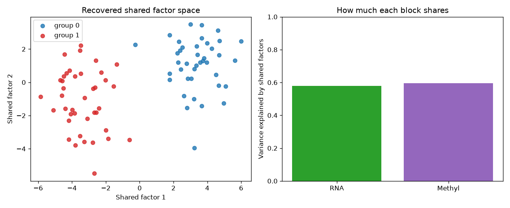

# multiomics-mofa-factor-integration

Stack two omics matrices, run a fancy factorisation, get a pretty plot. Ship it, right? Wrong.

Multiomics integration is where good intentions go to die. The maths is seductive and the failure modes are silent. This repo is a teaching scaffold for the single most portable idea in the field: **joint matrix factorisation** — the engine underneath MOFA, iCluster, and half the deep-learning papers you skimmed. Learn it here, in your own words, before you trust a black box.

## Demo Output



The figure above was produced entirely from simulated data by `demo.py` — two synthetic omics blocks sharing a latent factor, recovered by a shared low-rank decomposition.

## Why This Exists

Everyone wants to "integrate" their RNA-seq, methylation, and proteomics into one triumphant embedding. Almost nobody stops to ask whether the shared signal is biology or batch. This scaffold makes the shared-vs-private factor idea concrete so you can *see* when integration helps and when it invents structure.

The core intuition: given omics blocks X1, X2, ... measured on the same samples, find a shared factor matrix Z and per-block loadings W_k such that X_k is approximately Z @ W_k^T. Factors capture variation common across modalities; the residuals capture what is private (or noise, or batch).

## Decision Framework: Which Integration Approach?

| Situation | Use | Avoid |
|-----------|-----|-------|
| Same samples, moderate features, want interpretable factors | Matrix factorisation (this repo, MOFA) | Deep autoencoders |
| Different samples per modality | Diagonal / anchor methods | Naive concatenation |
| You have thousands of samples and GPUs | Deep learning integration | Hand-tuned factors |
| You just want clusters | Similarity network fusion | Overthinking it |
| Modalities on wildly different scales | Per-block standardisation FIRST | Raw concatenation |

## Quick Start

```bash
pip install -r requirements.txt
python demo.py            # self-contained, writes figures/ and results/
python integrate.py       # same technique, reusable functions
```

## When NOT to Use This

- **Mismatched samples.** If your proteomics and RNA come from different patients, a shared-Z model is a lie. Align first or don't bother.
- **One modality dominates the variance.** A high-variance block hijacks the shared factors. Standardise per block, always.
- **You haven't checked for batch.** A batch that spans all modalities looks *exactly* like real shared biology. The model cannot tell the difference. You have to.

## The Uncomfortable Truth

Most "multiomics integration" plots that go into papers are just batch effects wearing a lab coat. The factorisation will happily find a strong shared axis — and that axis is often the sequencing run, not the disease. Integration does not launder confounding; it concentrates it. Before you celebrate a shared factor, colour your embedding by every technical covariate you have. If the factor tracks the plate map, you found the robot, not the biology.

## Further Reading

Inspired by Ming 'Tommy' Tang, "Multiomics Integration: Methods and Caveats" (https://divingintogeneticsandgenomics.com/talk/2026-sapa-multiomics-integration-webinar/).
